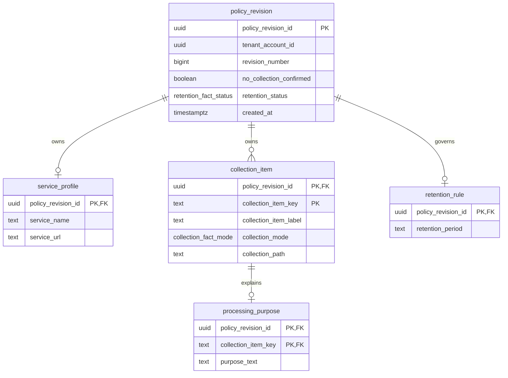

# Proposed policy revision ERD

Status: Proposed source contract; no database runtime is deployed.

`(tenant_account_id, revision_number)` is the revision version key. `(policy_revision_id, collection_item_key)` is the collection-item UPSERT/idempotency key. `tenant_account_id` is an external identity value without a database foreign key until PolicyWeave has an authorized released Keyverse boundary.

Deferred constraint triggers take `FOR NO KEY UPDATE` on the owning revision, reject moving an owned fact between revisions, and check final transaction consistency. Explicit no-collection forbids collection items. `retention_status = applies` requires one `retention_rule`; other statuses forbid one. Absence of an item or rule never manufactures an operator attestation.

This ERD reflects migration `db/migrations/0001_policy_revision.sql`. It does not include future audit, authorization, legal-source, review-finding, or publication tables because those contracts are not implemented in this migration.
